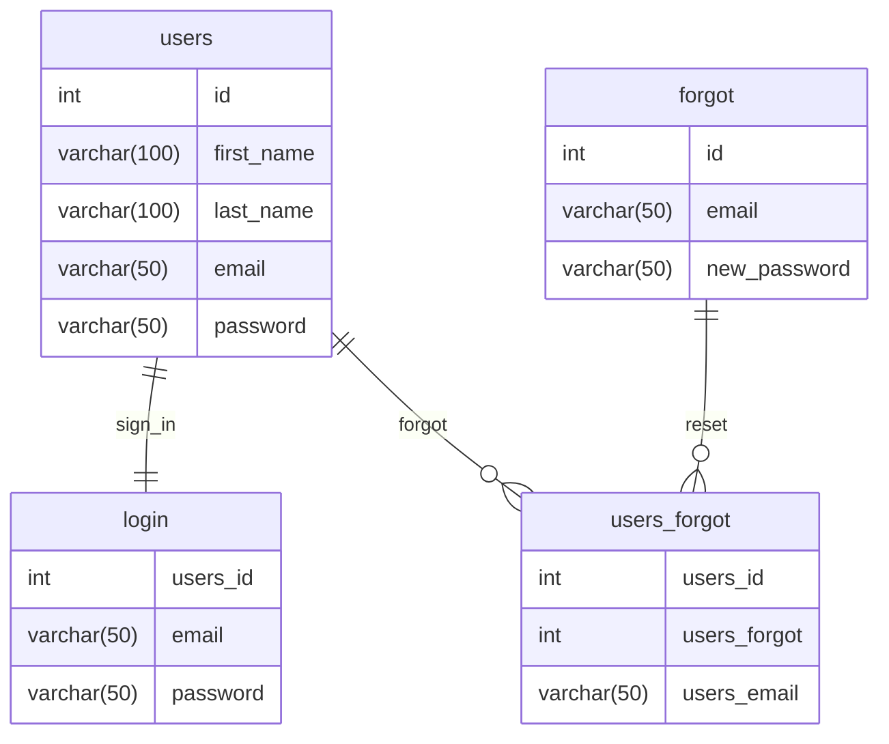

# ERD Authication Flow

```mermaid
erDiagram

users {
    int id
    varchar(100) first_name
    varchar(100) last_name
    varchar(50) email
    varchar(50) password
}

users_forgot {
    int users_id
    int users_forgot
    varchar(50) users_email
}

login {
    int users_id
    varchar(50) email
    varchar(50) password
}

forgot {
    int id
    varchar(50) email
    varchar(50) new_password
}

users ||--|| login : sign_in
users ||--o{ users_forgot : forgot
forgot ||--o{ users_forgot : reset
```
